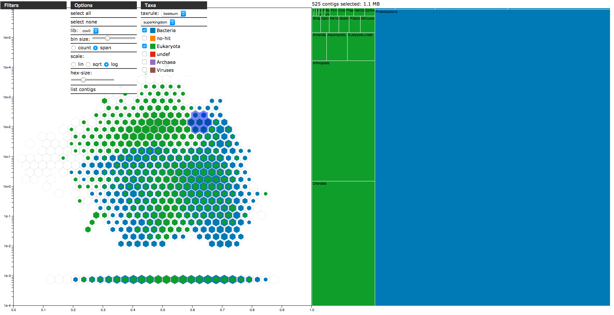

# jsblob - interactive blobplot exploration and filtering

This is a prototype for a contig-centered browser based data exploration tool with an example dataset of ~670,000 contigs from a combined assembly of two Tardigrade (*Hypsibius dujardini*) datasets. Contigs are grouped across hexagonal tiles of the plot area, hexagons are filled based on contig span and coloured according to taxonomic attribution. Click and drag across a set of bins to select them. A treemap of taxonomic attribution will be redrawn for each contig selection. Bins may be resized and scaled by count or span, taxonomic associations can be show at various taxonomic levels. Contig sets can be filtered based on selections or numeric value cutoffs.

To run a local version, clone this repository into a directory that can host web content, unzip the file ``json/blob.BlobDB.arr.json.gz`` then pint a browser at ``index.html``.

A limitation of the current version is that all data are stored in a single object so, for a dataset of this size, several tens of megabytes of data must be loaded before the dtaa can be plotted. A future implementation will address this issue by using a hierarchical, flatfile-based data model so only data required for plotting and the applied labelling or filtering are loaded with additional variables available when required.
